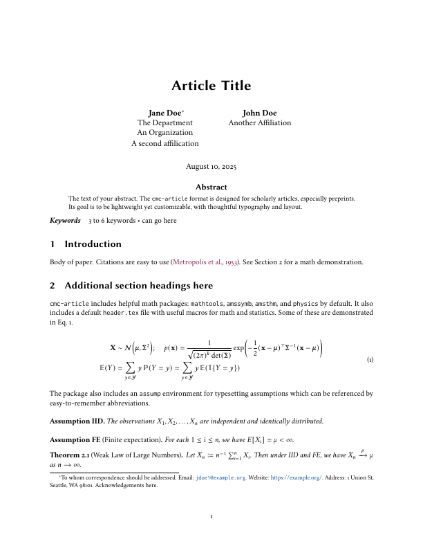

# `cmc-article` Quarto Format

## Creating a New Article

To create a new article using this format:

```bash
quarto use template CoryMcCartan/cmc-article
```

This will create a new directory with an example document that uses this format.

## Using with an Existing Document

To add this format to an existing document:

```bash
quarto add CoryMcCartan/cmc-article
```

Then, add the format to your document options:

```yaml
format:
  cmc-article-pdf: default
```    

## Example

Here is the source code for a minimal sample document: [template.qmd](template.qmd).
This produces the following document (click for a full preview):

<p align="center">
<a href="template.pdf">
<kbd>  </kbd>
</a>
</p>

## Options

Most Quarto PDF options are supported here, with the primary exception of
alternative font families (see below for font customization)
and anything to do with CSL references.
Additional package-specific options are described below.

### Blinded versions

Provide the following key under `cmc-article-pdf` to produce a blinded version of the article.
```yaml
journal:
  blinded: true
```

### Physics package

By default, the [`physics`](http://mirrors.ibiblio.org/CTAN/macros/latex/contrib/physics/physics.pdf) package is included.
Provide the following key under `cmc-article-pdf` to remove it:
```yaml
physics: false
```

### Fonts

#### Serif font
The default serif font is Cochineal, based on the Crimson font family.
If you would rather not use this font, either for file size or aesthetic reasons, you can provide the following flag.
Palatino will be used instead for the body text and mathematics.
```yaml
font-serif-cochineal: false
```

#### Sans-serif font
The default sans-serif font is Biolinium, part of the `libertine` package.
If you would rather not use this font, either for file size or aesthetic reasons, you can provide the following flag.
Helvetica will be used instead.
```yaml
font-sans-biolinium: false
```

#### Serif title headings

By default, the title and section headings are set in a sans-serif font. 
Provide the following key under `cmc-article-pdf` to use a serif font:
```yaml
font-serif-only: true
```

